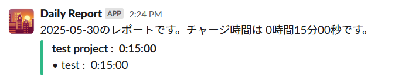

# toggl-report



A serverless application built with AWS SAM and Go that generates daily Toggl time tracking reports and sends them to Slack.

## Overview

This application fetches the previous day's time entries from Toggl, organizes them by project and task, and posts a summary report to a specified Slack channel. It runs as an AWS Lambda function scheduled to execute daily.

## Requirements

- AWS CLI
- AWS SAM CLI
- Go 1.24.3
- Toggl account with API access
- Slack workspace with webhook URL

## Data Structure

The application processes Toggl time entries with the following workflow:

1. **Data Retrieval**: Fetches time entries from the Toggl API for the previous day
2. **Workspace Filtering**: Filters entries by the specified Toggl workspace ID
3. **Project Categorization**: Groups entries by project
4. **Task Summarization**: Within each project, summarizes time spent on each task (description)
5. **Report Generation**: Creates a formatted report showing:
   - Total time tracked for the day
   - Time spent per project
   - Breakdown of time spent on each task within projects
6. **Slack Notification**: Sends the formatted report to Slack using a webhook

## Deployment

### Prerequisites

Before deployment, you need to set up the following parameters in AWS SSM Parameter Store:

```
/toggl-report/${Stage}/slack-web-hook-url    # Your Slack webhook URL
/toggl-report/${Stage}/slack-channel-name    # Target Slack channel name
/toggl-report/${Stage}/toggl-workspace-id    # Your Toggl workspace ID
/toggl-report/toggl-api-token                # Your Toggl API token
```

Where `${Stage}` is your deployment stage (e.g., dev, prod).

### Deployment Steps

1. Build and deploy the application using AWS SAM:

```bash
sam build
sam deploy --guided
```

2. Follow the prompts to specify deployment parameters:
   - Stack Name: Name for your CloudFormation stack
   - AWS Region: Region to deploy to
   - Stage: Deployment stage (dev, prod, etc.)
   - Confirm changes before deployment: Yes/No
   - Allow SAM CLI IAM role creation: Yes
   - Disable rollback: Yes/No

3. After deployment, the Lambda function will run automatically according to the schedule (daily at midnight UTC by default).

## Getting Your Toggl Workspace ID

To get your Toggl Workspace ID, make a request to the Toggl API using Basic Authentication:

```
https://api.track.toggl.com/api/v9/workspaces
```

Use your Toggl API token as the username and "api_token" as the password.

## Local Development

To run the application locally:

```bash
make build
sam local invoke TogglReportFunction
```

## License

See the LICENSE file for details.
